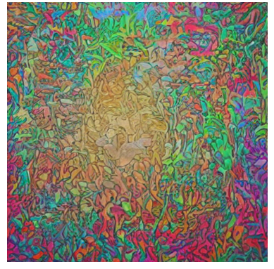

# 🛰️ Ground-to-Satellite Image Matching via Synthetic Satellite Generation and Joint Feature Learning

This repository provides an end-to-end pipeline for matching ground-level images to their corresponding satellite views. 
It combines synthetic satellite image generation, semantic segmentation, and a joint feature learning architecture for robust cross-view image matching.

---

## 📌 Overview

Matching ground-level photos to satellite imagery is challenging due to drastic perspective and scale differences. 
This project tackles this by generating synthetic aerial views from ground photos, segmenting them, and learning a joint representation using a contrastive approach.
The goal is to create an intermediate representation allowing a direct matching between a streetview image and its corresponding satellite image, without using any other data (e.g. GPS).

Given a streetview image (360°) and the corresponding satellite they get transformed and used to create a new satellite image. Then it gets segmented and now goes through 2 networks allowing the matching to be robust.

---

## 🗂️ Dataset

I used a version of CVUSA (Cross-view USA) dataset which is composed of streetview images and satellite images both standard format and polarmap, respectively with segmentation map.

This version of the Dataset can be found [here](https://drive.google.com/file/d/1c1hKJ7xBV4LbGcdQdotpHg-S18BRQ_Vy/view)

## 🧭 Pipeline

The full pipeline consists of the following stages:

1. **Synthetic Satellite Generation**  
   - 🔍 Ground image ➝ VisualCLIP encoder (from Openai, pretrained)
   - 🌀 VisualCLIP features ➝ Unet (pretrained Stable Diffusion) ➝ Synthetic Aerial Image
     
       Reference: https://huggingface.co/blog/stable_diffusion
   
   Normally a Unet receives word tokens as inputs. In this case, since the input needed to be an image, the embedding layer had to be changed to a VisualCLIP.
   VisualCLIP was frozen and did not undergo any finetuning. Similarly the VAEncoder which is part of Stable Diffusion was frozen.
   Both the encoders were of course pretrained. VisualClip's training is openai/clip-vit-base-patch32 which is a training on publicly available image-caption data (https://huggingface.co/openai/clip-vit-base-       patch32).
   The latter was a default choice embedding by Stable Diffusion team. 
   However total loss is computed by summing (proportionally) classic loss (between target and generated) but also Clip loss and Vae loss.

3. **Semantic Segmentation**  
   - 🗺️ Synthetic aerial ➝ SegFormer-B3 (pretrained on ADE20K) ➝ Segmentation map
     
     Reference: https://arxiv.org/pdf/2105.15203

     Comparing different models of the same family led to the choice of the b3 model. An intermediate model which is not too small to be capable of capturing relevant features,
     nor too big to make it difficult to train (https://huggingface.co/nvidia/segformer-b3-finetuned-ade-512-512). The model was pretrained on ADE20K which is a great dataset for this task since it comprehends        urban and aerial views. The training lasted 60 epochs, using a ReduceLROnPlateau scheduler and AdamW as the optimizer. CrossEntropyLoss was the chosen loss function (basically we used the techniques       suggested by the authors). Finally, due to hardware limitation, batch size was only 6.

---
          Ground Image
              (G)
               |
               v
         +-------------+
         |  VisualCLIP |  ← Pretrained (Openai)
         |   Encoder   |
         +-------------+
               |
      Visual Feature Vector
               |
               v
         +-------------+
         |     Unet     |  ← Pretrained Stable Diffusion
         +-------------+
               |
    Synthetic Aerial Image (A)
               |
               v
       +------------------+
       |  SegFormer B3    |  ← Pretrained on ADE20K
       | Semantic Segment |
       +------------------+
               |
               v
     Segmented Aerial Image (S)
     
---

4. **Joint Feature Matching**  
   - Input:  
     - Ground image (G)  
     - Synthetic aerial (A)  
     - Segmented aerial (S)  
     - Candidate satellite image (C)  

   - Process:  
     - Feature extraction via VGG16  
     - A and C share weights  
     - Fusion of features into two embeddings:  
       - `embedding_G` = FFN(G + A + S)  
       - `embedding_C` = FFN(A + C)  
     - Final match score computed via **triplet loss**

---

## 🧠 Architecture: JointFeatureLearningNet
                +--------+      +----------+
      G ------> | VGG_G  |      |          |
                +--------+      |          |
                                 |          |
                +--------+      |          |
      A ------> | VGG_A  | ---> |          |
                +--------+      |          |
                                 | FFN_G    | ---> embedding_G
                +--------+      |          |
      S ------> | VGG_S  |      |          |
                +--------+      |          |
                                 |          |
                                 +----------+

                +--------+      +----------+
      C ------> | VGG_C  | ---> |          |
                +--------+      |          |
                                 | FFN_C    | ---> embedding_C
                +--------+      |          |
      A ------> | VGG_A  | ---> |          |
                +--------+      +----------+

                 🔗 Triplet Loss(embedding_G, embedding_C)

- `VGG_G`, `VGG_S`, `VGG_A`, and `VGG_C` are VGG16 backbones.
- VGG_A and VGG_C **share weights**.
- All VGGs are pre-trained using ImageNet and are only finetuned.
- FeatureFusionNets (FFN) project feature concatenations into a shared embedding space and trained from scratch.
- Matching is supervised using **triplet loss**.

---
## 🎆 Results

Generation:

Original satellite

Pre-trained generation

Generation result

Segmentation:

Original segmentation

Pretrained segmentation

Segmentation result

## Feature Fusion & Extraction

JointFeatureLearningNet and FeatureFusion Net results are shown in the pdf file, same as overall results of the experiment.
